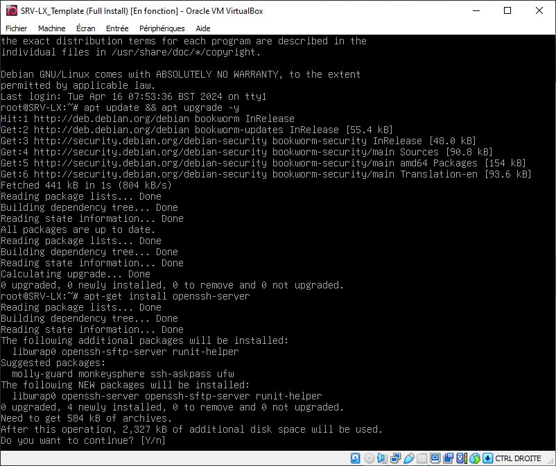
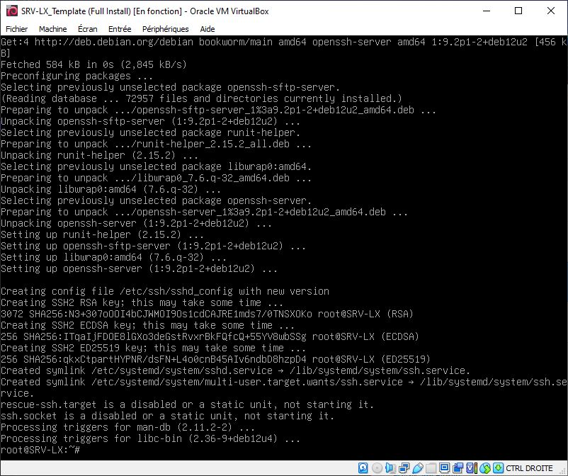
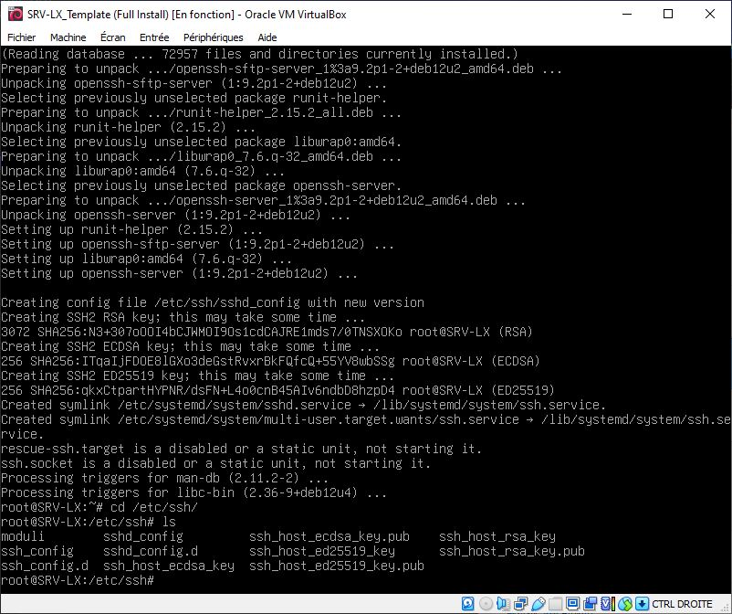
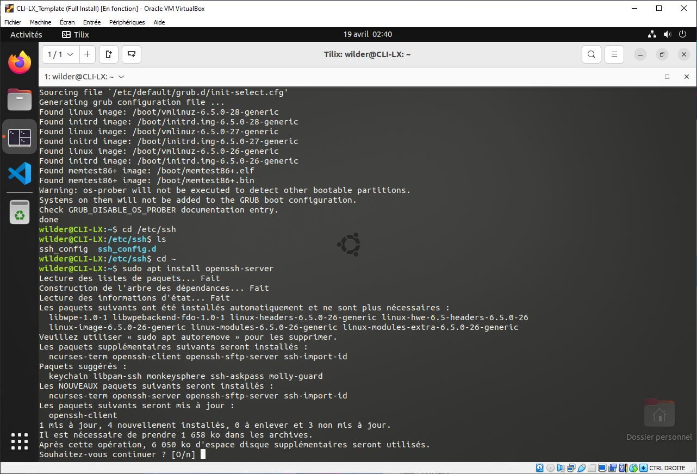
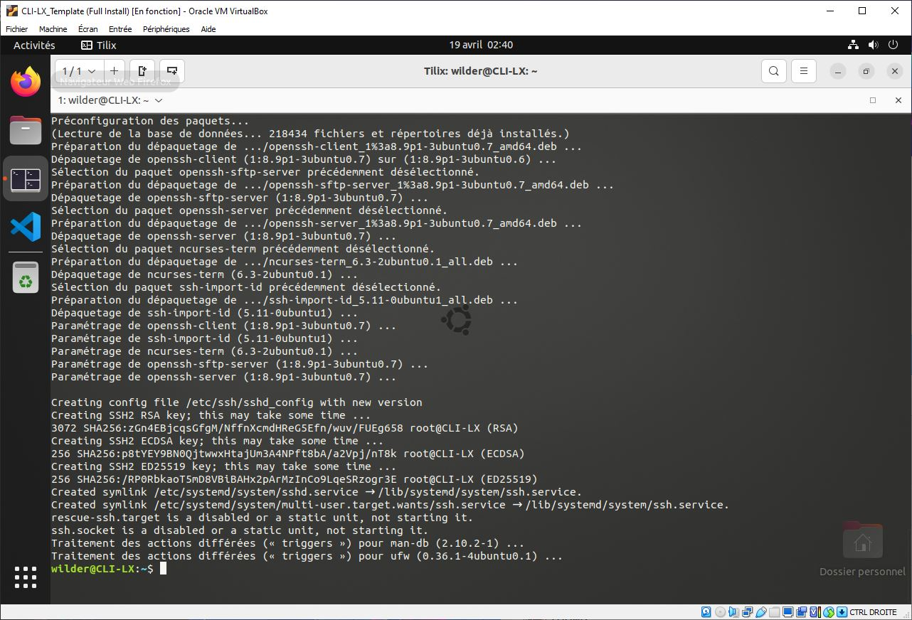
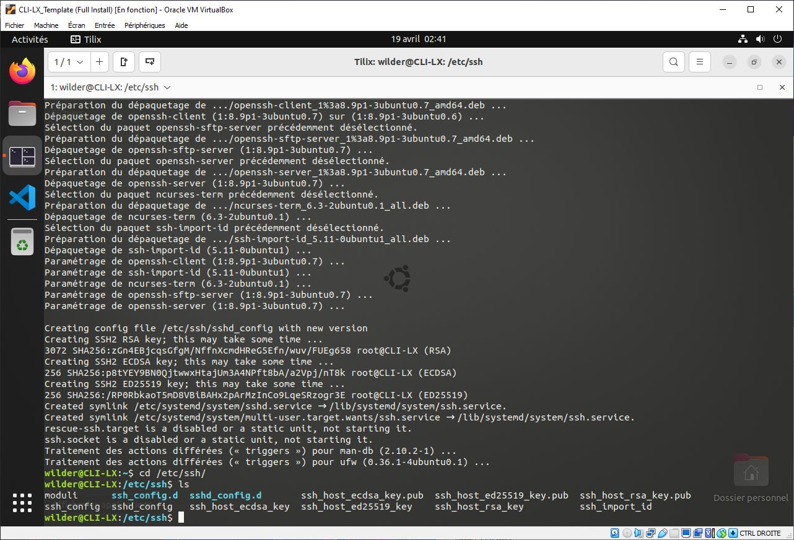
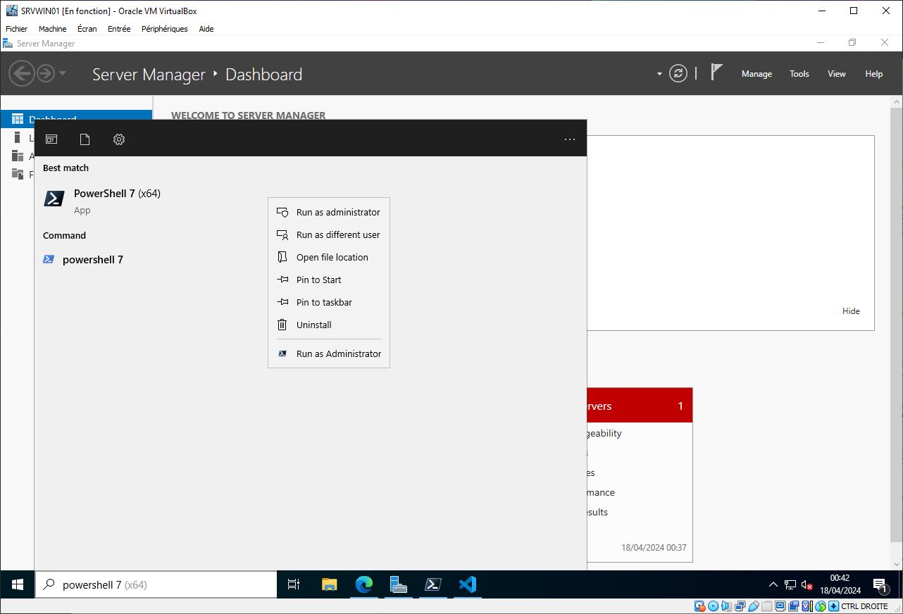
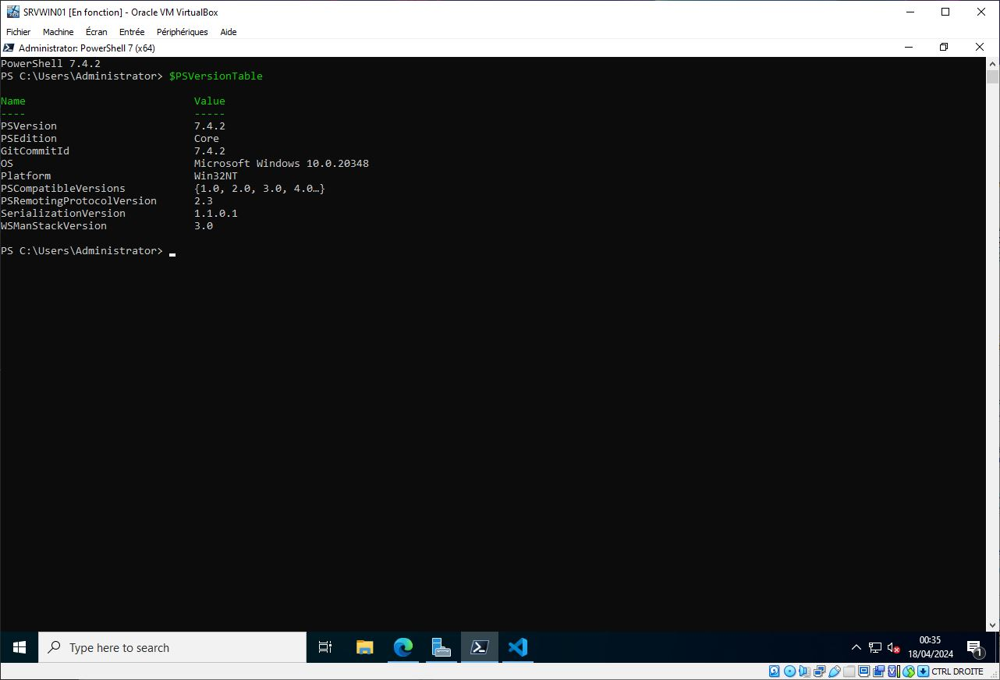

# **TSSR-2402-P2-G3-TheScriptingProject**

## **Sommaire**

1) Pré-requis techniques

2) Installation des sources nécessaires au bon fonctionnement

## **Pré-requis techniques**

### **Les Serveurs**

||Debian 12.5|Windows Server 2022|
|:-:|:-:|:-:|
|HostName|SRVLX01|SRVWIN01|
|Login|root|administrator|
|Password|Azerty1*|Azerty1*|
|Ip fixe|172.16.10.10/24|172.16.10.5/24|
|Spécificité||Powershell Core 7.4 LTS inclus|

### **Les Clients**

||Ubuntu 22.04 LTS 01|Ubuntu 22.04 LTS 02| Windows 10 Pro 01|Windows 10 Pro 02|
|:-:|:-:|:-:|:-:|:-:|
|HostName|CLILIN01|CLILIN02|CLIWIN01|CLIWIN02|
|Login|wilder|wilder|wilder|wilder|
|Password|Azerty1*|Azerty1*|Azerty1*|Azerty1*|
|Ip fixe|172.16.10.30/24|172.16.10.31/24|172.16.10.20/24|172.16.10.21/24|

### **Composants additionnels**

Une fois les configurations faites, nous devons pour la partie Linux ajouter un lien _ssh_ entre le Serveur et les Clients.

## **Installation des sources nécessaires au bon fonctionnement**

Bien entendu, il est nécessaire avant toute chose de procéder à une mise à jour système, aussi bien sur les Serveurs, que sur les Clients

* bash : (sudo) `apt update && apt upgrade -y`
* Windows : Mise à jour système en mode graphique

Il vous faudra également donner les droits d'accés au scripts en terme d'exécution, si cela n'est pas déjà fait.

### **Installation et configuration ssh sur Linux**

#### **Installation et configuration ssh sur Debian**

Assurez-vous que votre système est à jour avec `apt update && apt upgrade -y`

Installez le paquet `openssh-server` avec `apt install openssh-server`

Il vous sera demander durant l'installation si vous souhaitez continuer, saisissez `Y` puis `Entrée`

L'installation se termine alors toute seule

A la fin de l'installation, vos clés ssh sont disponibles dans le répertoire `/etc/ssh`

#### **Installation et configuration ssh sur Client Ubuntu**

De la même manière que pour le Serveur Debian, assurez-vous tout d'abord que votre système est à jour avec `sudo apt update && sudo apt upgrade -y`

Installez le paquet `openssh-server` avec `sudo apt install openssh-server`

Il vous sera demander durant l'installation si vous souhaitez continuer, saisissez `O` puis `Entrée`

L'installation se termine alors toute seule

A la fin de l'installation, vos clés ssh sont disponibles dans le répertoire `/etc/ssh`

### **Installation et configuration sur Windows**

#### **Installation et configuration sur Windows Server 2022**

Afin d'optimiser le fonctionnement du Script et par la même occasion respecter les pré-requis du Projet, il est nécessaire d'installer Powershell en version 7.4 LTS sur le Serveur Windows

Celui-ci est disponible sur la page [https://aka.ms/PSWindows](https://learn.microsoft.com/fr-fr/powershell/scripting/whats-new/migrating-from-windows-powershell-51-to-powershell-7?view=powershell-7.4)

Nous avons fait le choix d'installer le [Package MSI](https://learn.microsoft.com/fr-fr/powershell/scripting/install/installing-powershell-on-windows?view=powershell-7.4#msi)

Nous passons donc via Powershell 7 (x64) qu'il faut lancer en mode Adminstrateur (clique-droit sur le logiciel puis `Run as administrator`)

La version 7.4.2 est disponible sur le Serveur

#### **Installation et configuration sur Client Windows 10 Pro**

### **Installation et configurations des composants additionnels**

Différents scripts sont fournis avec la Documentation, à savoir :
* Un Script Powershell `admin-tool.ps1` qui devra être installé dans le `C:\Users\Administrator\` sur le Serveur Windows
* Un Script Powershell `hello.ps1` qui devra être installé dans le `C:\Users\wilder\` sur chacun des Clients Windows
* Un Script bash `admin-tool.sh` qui devra être installé à la racine du dossier personnel de `root` sur le Serveur
* Un Script bash `hello.sh` qui devra être installé à la racin du dossier personnel de `wilder` sur chaucun des Clients Ubuntu

Vous pouvez trouver tous ces scripts dans le dossier `attachment` du dépôt.