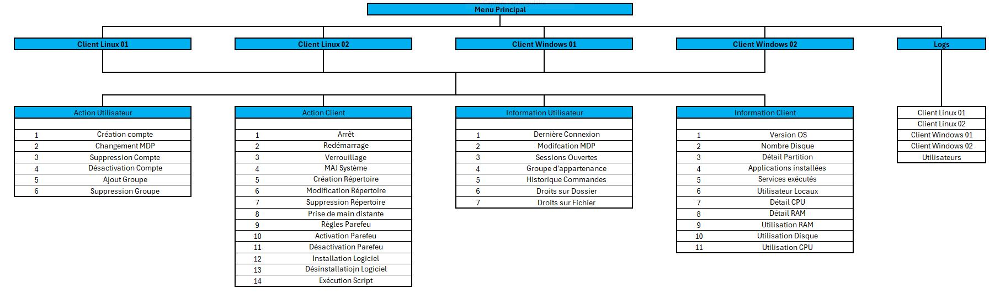
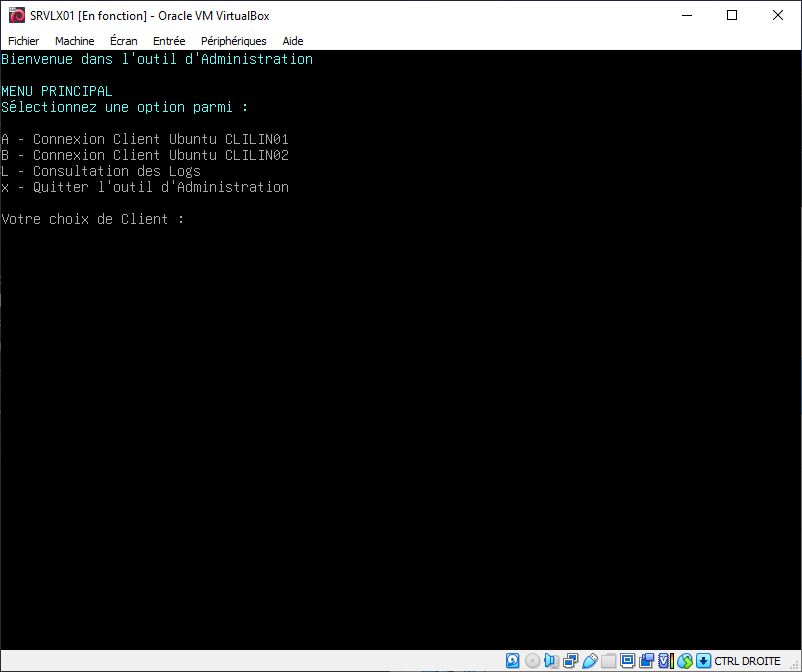
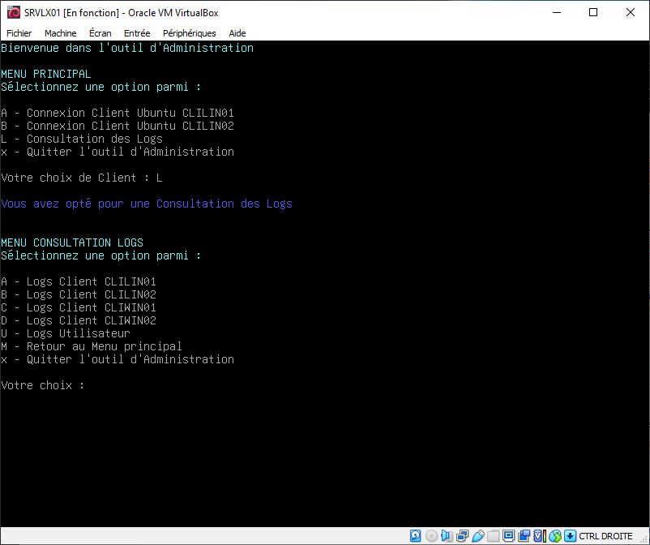
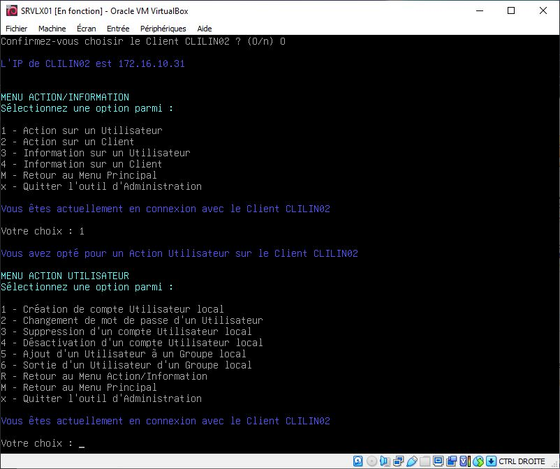
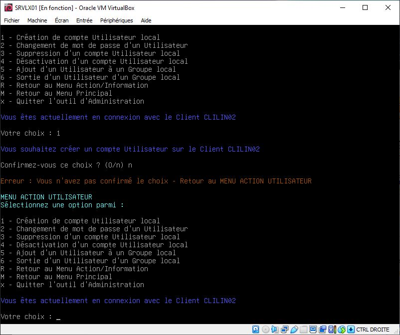

# **TSSR-2402-P2-G3-TheScriptingProject**

## **Sommaire**

1) Arborescence des scripts

2) Utilisation du script bash

3) Utilisation du script Powershell

4) Script is Future

## Arborescence des scripts

Les deux scripts Powershell et bash ont été rédigés selon la même arborescence.

Nous démarrons le script sur un Menu Principal, et poursuivons en naviguant dans les différents menus, ceci nous permet d'accéder rapidement à l'action ou à l'information escomptée

Voici un aperçu du déroulé du script en mode graphique

## **Utilisation du script bash**

Si la procédure d'installation a été respectée, le script se situe dans le dossier personnel de l'Administrateur `root@SRVLX01:~#`

Il est possible de démarrer le script via les commandes :
* `bash admin-tool.sh`
* `./admin-tool.sh` (uniquement si les droits d'exécution sont autorisés)

Dans le cas où vous procédez à une Action/Information sur un Client, si vous souhaitez changer de Client, il est nécessaire de revenir au Menu Principal

### Preview du script bash

Vous pourrez noter que les messages en Bleu foncé correspondent à des informations pour l'Utilisateur, et les messages en Jaune orangé sont des alertes.

## **Utilisation du script Powershell**

### Preview du script Powershell

## **Script is Future**

Le panel d'Actions et d'Informations possibles est certes limité, mais il est possible de l'étoffer un peu, merci de nous faire part de vos suggestions.

L'équipe se chargera d'étudier toutes vos proposisitons.

