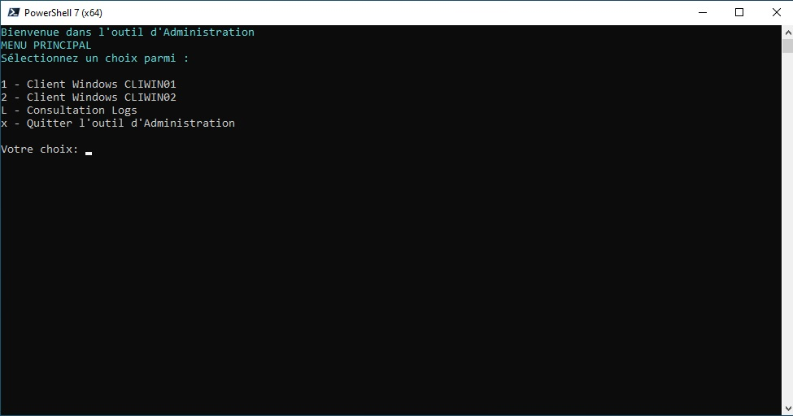
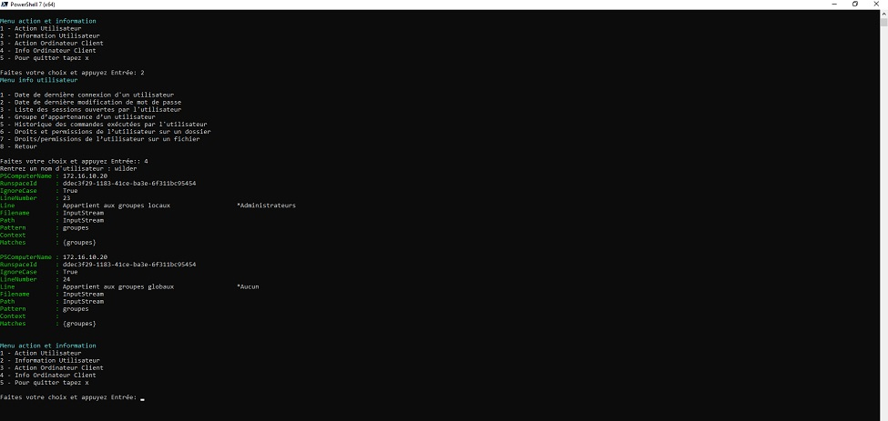

# **TSSR-2402-P2-G3-TheScriptingProject**

## **Sommaire**

1) Arborescence des scripts

2) Utilisation du script bash

3) Utilisation du script Powershell

4) Script is Future

## Arborescence des scripts

Les deux scripts Powershell et bash ont été rédigés selon la même arborescence.

Nous démarrons le script sur un Menu Principal, et poursuivons en naviguant dans les différents menus, ceci nous permet d'accéder rapidement à l'action ou à l'information escomptée

Voici un aperçu du déroulé du script en mode graphique

## **Utilisation du script bash**

Si la procédure d'installation a été respectée, le script se situe dans le dossier personnel de l'Administrateur `root@SRVLX01:~#`

Il est possible de démarrer le script via les commandes :
* `bash admin-tool.sh`
* `./admin-tool.sh` (uniquement si les droits d'exécution sont autorisés)

Dans le cas où vous procédez à une Action/Information sur un Client, si vous souhaitez changer de Client, il est nécessaire de revenir au Menu Principal

### Preview du script bash

Vous pourrez noter que les messages en Bleu foncé correspondent à des informations pour l'Utilisateur.

Dans le cas où vous ne confirmez pas correctement votre choix, ou bien si vous ne saisissez pas une option valide, un message en Jaune orangé apparaît pour vous avertir de l'erreur, et vous êtes automatiquement redirigés vers le menu en cours d'utilisation.

De même, à la fin de chaque Action ou Information qui se finalise avec succés, vous êtes automatiquement redirigés vers le menu en cours d'utilisation.

## **Utilisation du script Powershell**

Nous passons donc via Powershell 7 (x64) qu'il faut lancer en mode Adminstrateur (clique-droit sur le logiciel puis `Run as administrator`)

Si la procédure d'installation a été respectée, le script se situe dans le `C:\Users\Administrator`, utilisez la commande `Set-Location C:\Users\Administrator` pour vous y rendre.

Vous pourrez alors démarrer le script avec la commande `.\admin-tool.ps1`

Comme pour le script bash, dans le cas où vous effectuez une Action/Information sur un Client, si vous souhaitez changer de Client, il est nécessaire de revenir au Menu Principal.

### Preview du script Powershell

Vous pourrez noter que les messages en Bleu foncé correspondent à des informations pour l'Utilisateur.

Dans le cas où vous ne confirmez pas correctement votre choix, ou bien si vous ne saisissez pas une option valide, un message en Jaune apparaît pour vous avertir de l'erreur, et vous êtes automatiquement redirigés vers le menu en cours d'utilisation.

De même, à la fin de chaque Action ou Information qui se finalise avec succés, vous êtes automatiquement redirigés vers le menu en cours d'utilisation.

## **Script is Future**

Le panel d'Actions et d'Informations possibles est certes limité dans le script, mais il est possible de l'étoffer un peu, merci de nous faire part de vos suggestions.

L'équipe se chargera d'étudier toutes vos proposisitons.

